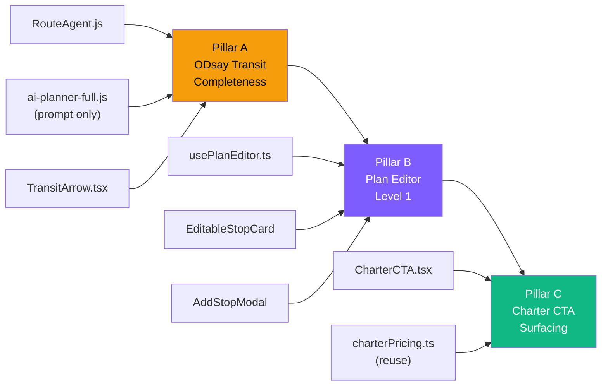

# CocoTrip v2 -- Transit-First Plan Experience

## Phase 0 Report

| File | Summary |
|------|---------|
| `RouteAgent.js` (305L) | Phase 1: Naver Geocoding (L38-67, address-only, no fallback). Phase 2: ODsay+Naver parallel (L72-91, no retry/timeout hardening). Phase 3: Time Stitching (L96-228). No `enforceTransitCompleteness` gate. |
| `PlanDetailPage/index.tsx` (521L) | Plan Firestore listener, activeDay tab state, PDF/translate hooks. Edit mode state does not exist yet. |
| `TransitArrow.tsx` (31L) | Shows method+duration+fare. step_by_step behind accordion (default closed). No handling for `_downgraded_from`. |
| `StopCard.tsx` (179L) | Expandable stop card. No edit mode, no delete button, no drag handle. |
| `plan.ts` (106L) | Stop/Day/TransitFromPrev interfaces. No `_stale`, `_downgraded_from`, `_userAdded` fields. |
| `i18n/index.ts` (3726L) | 4-language structure under `planner` section. No `planDetail.editor` or `planDetail.charter` keys. |
| `charterPricing.ts` (276L) | `detectCharterRecommendation()` matches stop names against tour keywords. Returns `{ recommended, tourType, pricing, reason }`. |

---

## Architecture Overview



**Execution order**: A -> B -> C (each pillar commits independently)

---

## Pillar A -- ODsay 100% Transit Completeness

### Invariant

> `stop.transit_from_prev.method` in `{subway, bus}` implies `step_by_step.length > 0` AND `instruction` is non-empty. Violation = auto-downgrade to `car`.

### 5-Layer Defense

| Layer | File | Change | Lines |
|:-----:|------|--------|:-----:|
| 1 | `api/ai-planner-full.js` | Add TRANSIT RULES to `buildSystemPrompt` (prompt text only, P1 Lock safe) | +15 |
| 2 | `api/_ai_core/agents/RouteAgent.js` | Geocoding multi-fallback: address -> name+region -> display_name | +20 |
| 3 | `api/_ai_core/agents/RouteAgent.js` | ODsay timeout 10s + 500ms backoff retry | +15 |
| 4 | `api/_ai_core/agents/RouteAgent.js` | `enforceTransitCompleteness()` gate function at end of `call()` | +25 |
| 5 | `src/pages/PlanDetailPage/components/TransitArrow.tsx` | step_by_step default open for subway/bus; `_downgraded_from` amber badge | +20 |

### Layer 1 -- Prompt Hardening

Added to `buildSystemPrompt` TRANSIT RULES section:

```
TRANSIT RULES (strict):
- walk if straight-line distance <= 800m
- Jeju (region includes "제주"): method = "car" or "taxi" only (no subway/bus)
- Rural areas (region /군$|면$|읍$/): method = "car"
- After 23:00 or before 05:30: method = "taxi"
- subway/bus MUST include instruction (Korean) AND from_label
- Never output subway/bus without step_by_step
```

### Layer 2 -- Geocoding Multi-Fallback

```js
// Current: address only (L44)
// New: 3-tier fallback
const queries = [
  address,                              // 1st: original address
  `${name} ${region}`,                  // 2nd: name + region combo
  place.display_name || place.name_en,  // 3rd: display name
].filter(Boolean);

for (const query of queries) {
  const res = await axios.get(geoUrl, { params: { query }, ... });
  if (res.data.addresses?.length > 0) { /* set lat/lng, break */ }
}
if (!lat) place._geocoded = false;
```

### Layer 3 -- ODsay Retry

```js
// Current: single call, no retry (L269)
// New: timeout 10s + 1 retry with 500ms backoff
async function searchWithRetry(sx, sy, ex, ey) {
  for (let attempt = 0; attempt < 2; attempt++) {
    try {
      return await searchTransitRoute(sx, sy, ex, ey, { timeout: 10000 });
    } catch (e) {
      if (attempt === 0) await new Promise(r => setTimeout(r, 500));
      else { transit._odsay_failed = true; return null; }
    }
  }
}
```

### Layer 4 -- enforceTransitCompleteness Gate

```js
// New function in RouteAgent.js (called at L230, before return)
_enforceTransitCompleteness(data) {
  const days = data.itinerary?.days || [];
  for (const day of days) {
    for (const stop of (day.stops || [])) {
      const t = stop.transit_from_prev;
      if (!t) continue;
      const needsDetail = t.method === 'subway' || t.method === 'bus';
      const hasDetail = Array.isArray(t.step_by_step) 
        && t.step_by_step.length > 0 
        && (t.instruction || t.instruction_en);
      if (needsDetail && !hasDetail) {
        t._downgraded_from = t.method;
        t.method = 'car';
        t.source = 'downgrade';
      }
    }
  }
}
```

Called at L230 (before `return` in `call()` method) -- **ai-planner-full.js untouched**.

### Layer 5 -- UI Changes (TransitArrow.tsx)

- `method === 'subway' || 'bus'`: step_by_step accordion **default open**
- `_downgraded_from` present: amber badge "Public transit unavailable for this route" (i18n key)
- Each step gets numbered icon (Bus/Train from lucide-react)

### File Size Check (Pillar A)

| File | Current | After | Verdict |
|------|:---:|:---:|:---:|
| `RouteAgent.js` | 305 | ~365 (+60) | OK (< 400) |
| `ai-planner-full.js` | 1273 | ~1288 (+15, prompt text only) | P1 Lock OK |
| `TransitArrow.tsx` | 31 | ~55 (+24) | OK |
| `plan.ts` | 106 | ~112 (+6) | OK |

---

## Pillar B -- Plan Editor Level 1

### Scope

| Feature | Behavior |
|---------|----------|
| Delete stop | X button -> ConfirmDialog -> fade-out -> Firestore |
| Reorder stops | Drag handle -> same-day only -> Firestore |
| Add stop | "+ Add Stop" -> modal form -> append -> Firestore |
| Edit mode | Toggle (default OFF). All edit UI hidden until ON. |
| Transit marking | Edited neighbors get `_stale = true` on transit_from_prev |
| Optimistic UI | Instant update, rollback on Firestore failure |

**NOT in scope**: cross-day move, auto time recalc, AI suggestions, undo/redo.

### New Files (6)

| File | Purpose | Est. Lines |
|------|---------|:---:|
| `hooks/usePlanEditor.ts` | Firestore optimistic + rollback | ~100 |
| `components/EditModeToggle.tsx` | Pencil/Check pill button | ~45 |
| `components/SortableStopCard.tsx` | StopCard + dnd-kit useSortable + delete btn | ~120 |
| `components/AddStopModal.tsx` | New stop input modal/bottom-sheet | ~180 |
| `components/ConfirmDialog.tsx` | Generic confirm overlay (delete use) | ~55 |
| `components/CharterCTA.tsx` | (Pillar C -- listed here for file count) | ~70 |

### Modified Files (5)

| File | Current | After | Delta |
|------|:---:|:---:|:---:|
| `index.tsx` | 521 | ~590 | +69 |
| `DayTimeline.tsx` | 29 | ~75 | +46 |
| `StopCard.tsx` | 179 | ~195 | +16 |
| `TransitArrow.tsx` | 31 (after Pillar A: ~55) | ~65 | +10 |
| `plan.ts` | 106 (after Pillar A: ~112) | ~118 | +6 |
| `i18n/index.ts` | 3726 | ~3830 | +104 |

### Dependencies

```bash
npm install framer-motion @dnd-kit/core @dnd-kit/sortable @dnd-kit/utilities
```

Total: ~70KB gzip. Current bundle ~380KB -> ~450KB (+18%).

### Data Flow

```
EditModeToggle (ON)
  |
  v
DayTimeline renders SortableStopCards
  |
  +-- User drags -> DndContext onDragEnd -> usePlanEditor.reorderStops(dayIdx, oldIdx, newIdx)
  +-- User clicks X -> ConfirmDialog -> usePlanEditor.deleteStop(dayIdx, stopIdx)
  +-- User clicks +Add -> AddStopModal -> usePlanEditor.addStop(dayIdx, stopData)
  |
  v
usePlanEditor:
  1. snapshot = structuredClone(plan)
  2. setPlan(optimistic) -- mark neighbors _stale
  3. Firestore updateDoc({ 'itinerary.days': updatedDays, edited: true, lastEditedAt: Date.now() })
  4. catch -> setPlan(snapshot) + toast error
```

### _stale Transit Strategy

When a stop is deleted/added/reordered, its neighbors' `transit_from_prev` becomes invalid:

```ts
// After delete stop[j]:
// stop[j+1].transit_from_prev._stale = true  (now connects to stop[j-1])

// After add new stop at position j:
// newStop.transit_from_prev = null  (no transit data)
// stop[j+1].transit_from_prev._stale = true

// After reorder:
// All moved stops + their neighbors: transit_from_prev._stale = true
```

UI shows amber badge: "Route may have changed" (i18n key `planDetail.editor.routeStale`).

**Level 2 (future)**: Auto-call ODsay to recalculate stale transits. Not in this release.

---

## Pillar C -- Charter Conversion CTA

### Trigger Logic

```ts
function shouldShowCharterCTA(day: Day): boolean {
  const transitCount = day.stops.filter(s =>
    s.transit_from_prev?.method === 'subway' || s.transit_from_prev?.method === 'bus'
  ).length;
  const downgradedCount = day.stops.filter(s => 
    s.transit_from_prev?._downgraded_from
  ).length;
  const totalTransitMin = day.stops.reduce((sum, s) => 
    sum + (s.transit_from_prev?.est_min || 0), 0
  );
  return transitCount >= 3 || downgradedCount >= 1 || totalTransitMin >= 120;
}
```

### CharterCTA.tsx Design

```
+--------------------------------------------------+
| [Car icon]  This day has many transit changes     |
|             Skip the hassle -- ride in comfort    |
|                                                   |
|  Seoul City Tour    8hrs    KRW 330,000           |
|  [View Charter Options ->]                        |
+--------------------------------------------------+
```

- Glassmorphism card: `bg-white/[0.04] border border-white/[0.08] backdrop-blur-sm`
- CTA links to `/charter?from=planDetail&day={dayNum}`
- Reuses `detectCharterRecommendation(day.stops)` -- no duplicate logic
- i18n keys: `planDetail.charter.suggestHeader`, `.suggestBody`, `.viewCharterCTA`, `.hoursLabel`

### File Impact

| File | Change |
|------|--------|
| `CharterCTA.tsx` (NEW) | ~70 lines |
| `DayTimeline.tsx` | +5 lines (conditional render) |
| `i18n/index.ts` | +16 lines (4 keys x 4 langs) |

---

## Complete Task List (18 tasks)

### Execution Graph

```
PILLAR A:
  [A1: Prompt hardening] ----+
  [A2: Geocoding fallback] --+-- parallel
  [A3: ODsay retry] ---------+
         |
  [A4: enforceTransitCompleteness] -- depends on A2, A3
         |
  [A5: TransitArrow UI] -- depends on A4
  [A6: plan.ts types] -- parallel with A5
  [A7: i18n keys (Pillar A)] -- parallel with A5
  [A8: tsc + mojibake check]
         |
  === COMMIT: fix: enforce ODsay transit completeness ===
         |
PILLAR B:
  [B1: npm install deps]
  [B2: i18n keys (Pillar B)] -- parallel with B3
  [B3: usePlanEditor hook] --+
         |                   |
  [B4: ConfirmDialog] ------+-- parallel (no mutual imports)
  [B5: AddStopModal] -------+
  [B6: SortableStopCard] ---+
  [B7: EditModeToggle] -----+
         |
  [B8: DayTimeline mod] -- depends on B6, B7
  [B9: StopCard mod] -- depends on B6
  [B10: index.tsx mod] -- depends on B3, B7, B8
  [B11: tsc + mojibake check]
         |
  === COMMIT: feat: plan editor Level 1 ===
         |
PILLAR C:
  [C1: CharterCTA.tsx]
  [C2: DayTimeline +CharterCTA] -- depends on C1
  [C3: i18n keys (Pillar C)]
  [C4: tsc + mojibake check]
         |
  === COMMIT: feat: charter CTA on high-transit days ===
```

### Task Detail Table

| # | Task | File | Type | Est. | Deps |
|:-:|------|------|:----:|:----:|:----:|
| A1 | Prompt TRANSIT RULES | ai-planner-full.js | modify | +15L | - |
| A2 | Geocoding 3-tier fallback | RouteAgent.js | modify | +20L | - |
| A3 | ODsay retry + timeout | RouteAgent.js | modify | +15L | - |
| A4 | enforceTransitCompleteness | RouteAgent.js | modify | +25L | A2,A3 |
| A5 | TransitArrow UI upgrades | TransitArrow.tsx | modify | +24L | A4 |
| A6 | plan.ts type additions | plan.ts | modify | +6L | - |
| A7 | i18n Pillar A keys | i18n/index.ts | modify | +16L | - |
| A8 | tsc + mojibake verify | - | verify | - | A5-A7 |
| B1 | npm install framer+dnd-kit | package.json | install | - | A8 |
| B2 | i18n Pillar B keys | i18n/index.ts | modify | +64L | - |
| B3 | usePlanEditor hook | NEW | create | ~100L | - |
| B4 | ConfirmDialog | NEW | create | ~55L | B2 |
| B5 | AddStopModal | NEW | create | ~180L | B2 |
| B6 | SortableStopCard | NEW | create | ~120L | B1 |
| B7 | EditModeToggle | NEW | create | ~45L | B2 |
| B8 | DayTimeline modification | DayTimeline.tsx | modify | +46L | B6,B7 |
| B9 | StopCard props addition | StopCard.tsx | modify | +16L | B6 |
| B10 | index.tsx wiring | index.tsx | modify | +69L | B3,B7,B8 |
| B11 | tsc + mojibake verify | - | verify | - | B10 |
| C1 | CharterCTA component | NEW | create | ~70L | B11 |
| C2 | DayTimeline +CharterCTA | DayTimeline.tsx | modify | +5L | C1 |
| C3 | i18n Pillar C keys | i18n/index.ts | modify | +16L | - |
| C4 | tsc + mojibake verify | - | verify | - | C2,C3 |

---

## i18n Keys Summary

### Pillar A (`planDetail.transit.*`)

| Key | en |
|-----|----|
| `publicTransitUnavailable` | Public transit unavailable for this route |
| `transitDowngraded` | Switched to driving directions |
| `realTimeRoute` | Real-time transit route |
| `stepsLabel` | Route steps |

### Pillar B (`planDetail.editor.*`)

| Key | en |
|-----|----|
| `editMode` | Edit Itinerary |
| `doneEditing` | Done Editing |
| `deleteConfirm` | Remove this stop from your itinerary? |
| `deleteButton` | Remove |
| `cancelButton` | Cancel |
| `addStop` | Add Stop |
| `nameLabel` | Place name |
| `addressLabel` | Address (optional) |
| `startTimeLabel` | Start time |
| `stayMinLabel` | Duration (min) |
| `categoryLabel` | Category |
| `saveFailed` | Failed to save changes. Please try again. |
| `routeStale` | Route may have changed |
| `addBtn` | Add |
| `userAdded` | Added by you |

### Pillar C (`planDetail.charter.*`)

| Key | en |
|-----|----|
| `suggestHeader` | This day has many transit transfers |
| `suggestBody` | Skip the hassle -- ride in comfort with a private driver |
| `viewCharterCTA` | View Charter Options |
| `hoursLabel` | hours |

> All keys provided in ko/en/ja/zh simultaneously per coding-rules.md section 2.

---

## Risk Matrix

| Risk | Pillar | Severity | Mitigation |
|------|:------:|:--------:|------------|
| ODsay retry doubles API calls on failures | A | Medium | Max 1 retry (2x worst case). Only on failure. ~5% total increase. |
| Prompt changes alter Gemini output quality | A | Medium | Only additive rules (no existing rules removed). Run validate-planner.js. |
| RouteAgent.js exceeds 400L | A | Low | Currently 305L + ~60L = ~365L. Under limit. |
| Firestore write fails after optimistic update | B | High | structuredClone rollback + error toast |
| Drag conflicts with mobile scroll | B | Medium | dnd-kit distance:8 activation constraint |
| _stale transit confuses users | B | Low | Clear amber badge with explanation text |
| PDF shows _stale indicators | B | Low | pdfGenerator reads DOM as-is; _stale badge is informational only |
| CharterCTA shows on Jeju (all car) | C | Low | Transit count check: car method not counted as subway/bus -> CTA not triggered by car-only days |
| Bundle +70KB too heavy | B | Low | 380->450KB (+18%). Acceptable for feature value. |

---

## LOCKED Files Verification

| File | Status | Evidence |
|------|:------:|---------|
| `useAutoTranslate.ts` | UNTOUCHED | Not in any task's file list |
| `pdfGenerator.ts` | UNTOUCHED | Not in any task's file list |
| `ai-planner-full.js` | P1 LOCK RESPECTED | Only `buildSystemPrompt` prompt string modified (A1). No logic/signature changes. |

---

## Success Criteria

### Pillar A
- [ ] 10 sample plans: method in {subway,bus} AND step_by_step empty = **0**
- [ ] Jeju region: method in {subway,bus} = **0**
- [ ] Seoul/Busan: transit.source === 'odsay' ratio >= **95%**

### Pillar B
- [ ] Delete/add/reorder -> Firestore persists -> survives refresh
- [ ] Network failure -> UI rollback + toast
- [ ] iPhone Safari touch drag works
- [ ] `npx tsc --noEmit` clean

### Pillar C
- [ ] Day with 3+ subway/bus transfers -> CTA visible
- [ ] Day with 1+ downgraded transit -> CTA visible
- [ ] Jeju plan (all car) -> CTA not shown
- [ ] CTA click -> `/charter?from=planDetail&day=N`

---

## Commits (3)

```
fix: enforce ODsay transit completeness invariant (Pillar A)
feat: plan editor Level 1 with delete/reorder/add (Pillar B)
feat: surface charter CTA on high-transit days (Pillar C)
```

---

**Phase 1 complete. Approve this plan to proceed to Phase 3 (execution, starting with Pillar A tasks A1-A8).**
